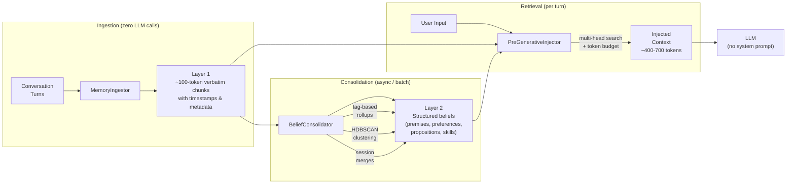

# Micro-RAG (mRAG)

Micro-RAG is a lightweight, framework-agnostic memory management system for LLM agents. It decouples memory formation, storage, retrieval, and context-window management into independent components that integrate with any LLM harness or orchestrator.

## Design

Micro-RAG uses a **two-layer memory architecture**: raw conversation text is stored verbatim as Layer 1 chunks, and structured beliefs are derived from those chunks as Layer 2. This means ingestion is instant (zero LLM calls — just chunking and hashing), and no information is ever lost to extraction judgment. Beliefs are formed asynchronously by the consolidator and serve as a derived index over the permanent record.

At retrieval time, the injector searches across both layers, assembles the most relevant facts within a fixed token budget, and injects them into the prompt — no system instructions, no coaching, just context.



### Components

| Component | Role |
| :--- | :--- |
| **MemoryIngestor** | Stores every conversation event (user input, assistant output, tool returns) as verbatim ~100-token chunks with timestamp prefixes and source metadata. Zero LLM calls — pure text handling. These Layer 1 chunks are the permanent record; everything else is derived from them. |
| **BeliefConsolidator** | Derives structured Layer 2 beliefs from raw chunks. Runs in three modes: (1) **per-session extraction** — one LLM call per conversation turn batch to extract facts, (2) **tag-based rollup** — consolidates same-subject/same-category clusters once they cross a size threshold, (3) **HDBSCAN clustering** — periodic embedding-geometry pass that finds clusters the tag-based path misses, plus additive session merges that combine parallel facts (e.g., multiple hobbies) into compact statements. Also powers `run_nightly_review`, which sweeps unreviewed Layer 1 chunks in large batches to form new beliefs with provenance links back to the source chunks. |
| **BeliefStore** | JSON-backed storage for both layers. On write, distinguishes paraphrases (corroborates existing belief) from value changes (supersedes prior value) using template + salient-token matching. Tracks confidence, computed relevance, timestamps, and explicit relations between facts. |
| **PreGenerativeInjector** | Retrieves relevant memories via multi-head candidate gathering — generates parallel search terms from the input (proper nouns, bigrams, significant words, auto-learned concept expansions), matches against stored content by exact stemmed-word matching, and separately matches via embedding cosine similarity for paraphrase recall. Candidates are ranked by how many independent search heads matched (breadth over depth), with near-duplicates and synthesis-covered constituents collapsed. Final selection is capped to a fixed token budget. |
| **ContextCompressor** | Rolling context-window manager that summarizes older turns into compact recollections once a token/turn threshold is crossed, while preserving recent turns verbatim for downstream extraction. |

## Installation

Clone the repository and install it locally in editable mode:
```bash
git clone https://github.com/munch2u-a11y/mRAG.git
cd mRAG
pip install -e .
```

Or install with specific vector database extras:
```bash
pip install -e .[chromadb]  # For local ChromaDB support
pip install -e .[pinecone]  # For cloud Pinecone support
```

You can also install directly from GitHub:
```bash
pip install git+https://github.com/munch2u-a11y/mRAG.git
```

## Usage Example

```python
from mrag import BeliefStore, create_vector_store, PreGenerativeInjector

# 1. Setup Data Store
belief_store = BeliefStore(data_dir="./mrag_data")

# 2. Select Vector Database Backend (e.g. 'chromadb', 'pinecone', or 'dummy' for sandboxed testing)
vector_store = create_vector_store("chromadb")

# 3. Setup Pre-generative Injector Pipeline
injector = PreGenerativeInjector(belief_store=belief_store, vector_store=vector_store)

user_input = "Hello, what do you know about me?"

# 4. Inject Beliefs (Run this BEFORE calling your LLM)
injected_context = injector.inject(trigger_text=user_input)
print(injected_context)
# --- Injected Context ---
# • User prefers Python [0.95]
# ------------------------
```

See the `examples/` directory for a full simulation of LangGraph integration with compression and belief consolidation.

## Benchmarks

All numbers below were produced by the scripts in `tests/` on the code in this
repository; the full reports (JSON + Markdown, with methodology notes) live in
`benchmarks/`. Retrieval always uses real embeddings (Chroma's default
all-MiniLM-L6-v2); LLM-dependent steps in the token-efficiency protocol use
deterministic extractive mocks so every run is reproducible without API keys.
Prompt and injection token counts use a tokenizer-backed counter when
available (`tiktoken` by default; override with `MRAG_TOKENIZER_MODEL` or
`MRAG_TOKENIZER_ENCODING`) instead of a chars-per-token heuristic.

### Token efficiency over time (`run_token_efficiency_benchmark.py`)

A simulated 200-turn agent session (facts introduced every 5 turns, rolling
compression + belief consolidation + injection) versus the same session with
naive full-history prompting:

| Turn | Full history | Micro-RAG | Per-turn saving |
| ---: | ---: | ---: | ---: |
| 50   | 4,509 tokens  | 4,621 tokens | -2.5% |
| 100  | 9,048 tokens  | 5,196 tokens | 42.6% |
| 150  | 13,657 tokens | 2,106 tokens | 84.6% |
| 200  | 18,267 tokens | 3,055 tokens | 83.3% |

- **Cumulative prompt tokens over 200 turns: 65.4% fewer** (631k vs 1.82M) — and the saving keeps growing with session length.
- Long-range fact recall via compressed context + injection: **0.86** overall, **0.88** for facts more than 100 turns old (full-history baseline is 1.0 by construction, at full token cost).
- Skill retrieval: **20/20** natural-language task queries surfaced the correct imported tool in the top-5 injection.

### Retrieval quality and latency

| Benchmark | Result |
| :--- | :--- |
| Needle-in-a-haystack, 5k memories | recall **1.000**, precision margin 0.64 |
| Multi-hop associative recall, 5k distractors | both chain facts recalled **1.000**, graph expansion overhead ~0 ms |
| 100k memories, top-5 after rerank | target hit rate **20/20** |
| 100k retrieval + rerank overhead | **~3 ms** (2.8 ms ANN query + 0.2 ms rerank) |
| 100k end-to-end `inject()` | ~156 ms, dominated by CPU query embedding — swap in a faster/hosted embedder to reduce it |

Reproduce with:
```bash
python tests/run_token_efficiency_benchmark.py
python tests/run_niah_benchmark.py
python tests/run_associative_benchmark.py
python tests/run_100k_benchmark.py
```

No vendor comparison numbers are published here on purpose: other systems'
published results are not normalized to these protocols. The scripts are
self-contained, so you can run the same protocol against any system you want
to compare with.

### Real-conversation QA benchmarks

The benchmarks above use deterministic extractive mocks for the LLM-dependent
steps. The results below run the full pipeline end to end against real long-
form conversation datasets, with `gemini-2.5-flash` doing fact extraction,
answer generation, and grading. Full per-question logs are in `benchmarks/`.

| Dataset | Questions | End-to-end accuracy | Retrieval accuracy | Avg. injected tokens |
| :--- | ---: | ---: | ---: | ---: |
| [LoCoMo](https://github.com/snap-research/locomo) (conv 0, strict grading) | 40 | **92.5%** (37/40) | ~95% | ~738 |
| [ConvoMem](https://huggingface.co/datasets/Salesforce/ConvoMem) (24Q, run 1) | 24 | **87.5%** (21/24) | 95.8% | ~412 |
| [ConvoMem](https://huggingface.co/datasets/Salesforce/ConvoMem) (24Q, run 2 — fresh sample) | 24 | **91.7%** (22/24) | 95.8% | ~394 |
| [LongMemEval_S](https://github.com/xiaowu0162/LongMemEval) (seed 42, 40Q) | 40 | 77.5% | ~94% | ~496 |

**Grading methodology:** LoCoMo uses strict PASS/MISS grading (no lenient
semantic matching). ConvoMem uses LLM-judge grading via the
[memorybench](https://github.com/mem0ai/memorybench) harness. All miss audits
are documented in the per-question markdown reports in `benchmarks/`.

**No answering prompt:** The answering model receives no system prompt, no
role instructions, and no coaching (e.g., "answer only from context" or
"say I don't know if unsure"). It gets the retrieved context and the question
— nothing else. Strict context → question → answer.

**Where misses come from:** Across all runs, remaining misses fall into two
categories: (1) *retrieval gaps* — the relevant belief was never surfaced
(e.g., a fact was consolidated away during ingestion, or a knowledge-update
superseded the wrong version), and (2) *question design issues* — questions
requiring implicit inference from context that was never stated in the
conversation. Model-side "I don't know" errors were eliminated by removing
coaching instructions from the answering prompt.

**ConvoMem category breakdown (run 2, 24Q):**

| Category | Accuracy |
| :--- | ---: |
| User-stated facts | 100% (4/4) |
| Abstention (unanswerable) | 100% (4/4) |
| User preferences | 100% (4/4) |
| Information updates | 100% (4/4) |
| Assistant-stated facts | 75% (3/4) |
| Implicit reasoning | 75% (3/4) |

**Token efficiency:** The `PreGenerativeInjector` caps injected context at a
fixed token budget regardless of how large the underlying belief store grows.
A LongMemEval context block with ~155k raw conversation tokens is reduced to
~496 injected tokens at retrieval time — a **>300x reduction in
latency-critical prompt tokens** while maintaining high retrieval accuracy.

Reproduce with:
```bash
python tests/run_locomo_benchmark.py
```
Requires a `GEMINI_API_KEY` (see the script header for how credentials are
loaded). ConvoMem runs use the external memorybench harness — see
`benchmarks/` for the full JSON reports.

## Testing

```bash
python -m unittest discover tests
```

The suite covers the belief store (decay, pruning, cache/index consistency),
the injector (retrieval, anti-repetition fallback, index sync), the context
compressor, the vector store factory, and all skill/soul adapters.

## Skills Adapters

If you already have existing agents with defined tools/skills, you can import them directly into Micro-RAG's `BeliefStore` as `skills` using the `mrag.adapters` module:

### OpenAI Tools Format
```python
from mrag import adapters, BeliefStore

belief_store = BeliefStore(data_dir="./mrag_data")

openai_tools = [
    {
        "type": "function",
        "function": {
            "name": "get_weather",
            "description": "Get current weather info."
        }
    }
]
adapters.import_openai_tools(openai_tools, belief_store)
```

### Model Context Protocol (MCP)
```python
mcp_tools = {
    "tools": [
        {
            "name": "calculate_tax",
            "description": "Calculate tax rate based on zip code."
        }
    ]
}
adapters.import_mcp_tools(mcp_tools, belief_store)
```

### Custom YAML/JSON Directories (Hermes, OpenClaw, etc.)
You can import a directory of skill files:
```python
adapters.import_from_directory("./my_skills_dir", belief_store)
```
You can also pass a `custom_parser` to extract name/description mapping from any proprietary schema structure.
